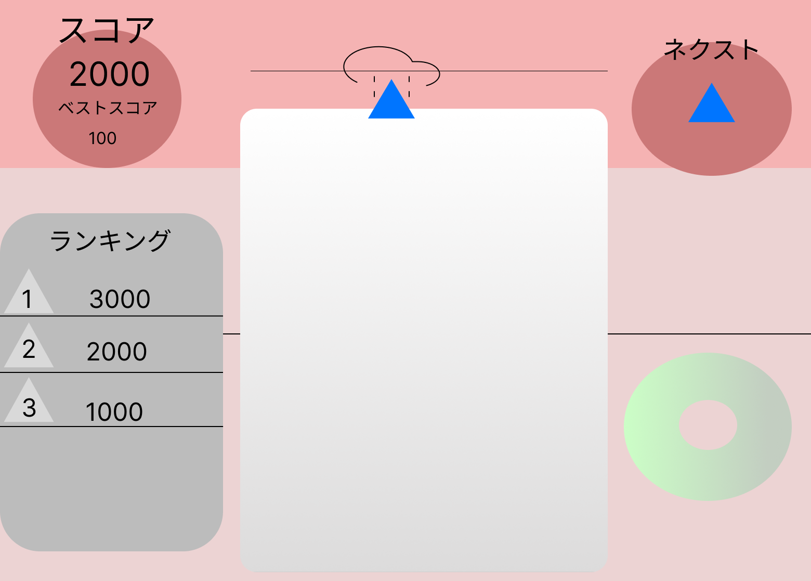
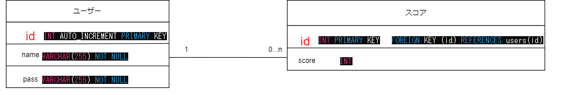

# 作成するゲーム
## ブロックゲーム(仮)

# 動機
* 文化祭に向けて何か作成できるゲームはないかと考えたときにこのゲームを作成してみたいと思った。
* また、学園祭では低年齢層のカスタマーが多いためなるべく簡単なゲームが作成できたらなと考えた。


# ゲームの目的
* ブロックを組み合わせていき高得点を目指すゲーム
* ランキングを表示し、競争心を促す

# 基本的なルール
* バケツの中に様々なブロックを上から入れていき積み上げていく
* 同じブロックが合わさると大きなブロックに変化していく最終的に一番大きなブロックの完成を目指していく
* ブロックが合わさるたびにスコアが増えていくのでそれを続けていき高得点を目指す
* バケツの中身がいっぱいになるとゲーム終了
# UI


# 基本的な要素
* バケツ、バケツに入れるブロック
* スコアの表示、計算
* 画面のレイアウト
* ブロックの挙動の処理

# データ構成

```
CREATE DATABASE fruit;

CREATE TABLE users (
  id INT AUTO_INCREMENT PRIMARY KEY,
  name VARCHAR(50) NOT NULL,
  pass VARCHAR(255) NOT NULL
);


CREATE TABLE scores (
    id INT PRIMARY KEY,
    score INT,
    FOREIGN KEY (id) REFERENCES users(id)
);
```

必要な機能
+ バケツ、バケツに入れるブロック
  + バケツの表示
  + ブロックの描画
  + 実装するブロックの数

+ スコアの表示、計算
  + スコアの表示
  + ブロックが合わさったときの計算の処理

+ 画面のレイアウト
  + 次に落ちてくるブロックの表示
  + ブロック一覧の作成

+ ブロックの挙動の処理
  + ブロックが落ちるときの処理
  + ブロックが合わさる時の処理
  + ブロックがバケツからはみ出さないようにするための処理
  + ブロックが止まる位置の処理
  + ブロック同士が干渉した時の処理

## スコアの例(ブロック作成時)
* 1   0pt
* 1→2 1pt
* 2→3 3pt
* 3→4 6pt
* 4→5 10pt
* 5→6 15pt
* 6→7 21pt
* 7→8 28pt
* 8→9 36pt
* 9→10 45pt
* 10→0 55pt 

# 使用する言語
* HTML
* CSS
* typescript:react(JavaScript:react)
* Python:flask

# 実装方法
* プログラム
* UIデザイン
* サウンド

# スケジュール Git hubで管理
* 2024/5/8 作成開始
* 2024/5/9~31 未定
* 2024/6/1~31 未定
* 2024/7/1~7 テスト
* 2024/7/8~12 最終的な調整
* 2024/7/13.14 学園祭

